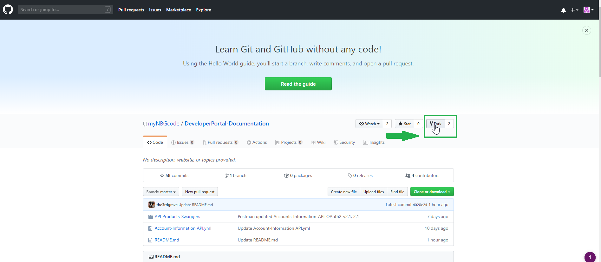

# *Developer Portal Documentation*

The Single Point of Truth for the NBG Developer Portal documentation pages. 

## **Contribute with our Team**

We encourage you to contribute on our documentation maintenance by Forking our repo.
Forking a repository allows to freely experiment with changes in any file without affecting the original project.

Below you will find easy steps on how to perform Fork function.

### **1. Pull the documentation you want to change**

When you want to make a change or enrich a current file, you have two alternatives in order to make changes:

* By clicking  *EDIT*  button ()  you create a working copy of the file in your local repository. 

* By clicking the *FORK* button () at the top right of the github page in order to fork your own copy of the project into your repo-account.

**Git pull command** is used to fetch and download content from a remote repository and immediately update the local repository to match that content.

**Git pull command** is  a combination of two commands, **git fetch** followed by **git merge**. 

In the first stage of operation git pull will execute a git fetch scoped to the local branch that HEAD is pointed at. Once the content is downloaded, git pull will enter a merge workflow. A new merge commit will be-created and HEAD updated to point at the new commit.

**Git branch** command we can see in which branch we are currently working on.

**Git fetch** command checks and ensures that updates have occured.

**Git pull** command we can pull down the updates that have been recently pushed . It is actually merging the updates fetched with the current branch.

### 2. Edit the documentation on your an editor of choice (locally)

**Suggested Editors**

[Apicurio](https://www.apicur.io/) 

[Swaggerhub](https://app.swaggerhub.com/) 

[Visual Studio Code Swagger Editor Extension](https://marketplace.visualstudio.com/items?itemName=42Crunch.vscode-openapi)

### 3. Submit a pull request to this repo

When you are done with your changes, all you have to do is to request a "pull". That means that a member of NBG Developer Portal team will review your changes and then will accept or reject your request. 

*Steps* to request a **Pull**

1. **Fork** the project with the clone command.

[Git Clone Example](https://https://github.com/myNBGcode/DeveloperPortal-Documentation/edit/master/README.md)

2. **Navigate** to the cloned directory with the cd command

Example: cd README 

3. Assign the original repo to a remote called "upstream". 

*Note that:* Upstream and downstream refers to the repository.

***Upstream** is from where you clone the repository*

***Downstream** is any project that integrates your work with other works.*

[git remote add upstream](https://https://github.com/myNBGcode/DeveloperPortal-Documentation/edit/master/README.md)

4. Get the latest changes with the **pull command**

Example: git checkout master
         git pull upstream master
         
The git checkout command lets you navigate between the branches created by git branch

5. **Create a new topic branch** to contain your feature or change.

Example: git checkout -b <topic-branch-name>

6. Push your topic branch up to your fork.

Example: git push origin <topic-branch-name>

7. Raise a Pull Request with an informative title and description.

8.  When the Pull Request is raised you can get back into master and delete the topic branch.

Example: git checkout master
         git branch -D <topic-branch-name>

 We are looking forward to meet each and every meaningful contribution of yours.

## Acknowledgments
Please do not hesitate to [contact us](developer.nbg.gr) if you face any difficulties.

## Thank you
The NBG Developer Portal Support Team

